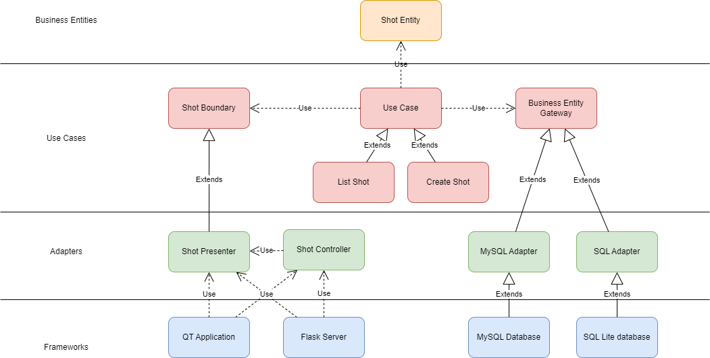

## Description
This is a demo project to show how we can use the 'Clean Architecture'
from Uncle Bob (https://blog.cleancoder.com/uncle-bob/2012/08/13/the-clean-architecture.html) in Python. 
To show how flexible and decoupled the architecture can be, we are using
two different databases: one in SqlLite and the other in MySQL, both
of them using a different schema. 
For the user interface, we are using
both QT and Flask (HTML). 
The specificities on the databases and the user interfaces API have no
impact on the core implementation of the tool, proving that we can
keep the volatile details outside the core in an easy fashion.

## Fictional tool and its requirements
The demo project is a fictional tool for a VFX studio.
The users are artist managers and the finance department.

The **business rules** are that the shots need to follow a specific nomenclature.
Also, it needs to show if it is over budget or not.

The **use cases** are that artists should be able to list, create, edit and delete shots.

We need to have a **view** for artist managers and another one for finance. 
Technically, we don't want to share financial information with artist managers.
The color coding required by both finance and artist managers are different for the shot listing. 

In terms of **framework**, the tool should be able to run as a standalone and a webpage.
The database will be migrated soon to a new database with a new schema, 
so we need to support MySQL and SqlLite.

## Requirements
- Python 3.8.1
- PySide 2
- Flask
- MySql

## Run Flask in Powershell
cd clean-architecture\clean_architecture\frameworks\user_interface\flask
$env:FLASK_APP='app.py'

flask run

## Run QT app
Add the project folder to the python path, then run:

python clean-architecture\clean_architecture\frameworks\user_interface\qt\app.py

## Simple UML class diagram
In the following figure, we can see that all the dependencies are towards abstraction,
from the bottom (the outer circle of clean architecture) to the top (the inner circle).

